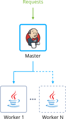

##  Jenkins DevOps Pack

By default, the JPS package deploys Jenkins Cluster that initially contains 1 certified Jenkins container acting as a primary (previously known as master) node and 2 is secondary (previously known as slave) nodes acting as workers. Workers can be scaled horizontally from 1 to 10 nodes with auto-discovering and self-registering inside the primary node.

### Highlights
This package is designed to deploy Jenkins environment is an open-source continuous integration server with 300+ plugins to support all kinds of software development. As an extensible automation server, Jenkins can be used as a simple CI server or turned into the continuous delivery hub for any project.

### Environment Topology

 

### Specifics

Layer                |     Server    | Number of CTs   by default | Cloudlets per CT   (reserved/dynamic) | Options
-------------------- | --------------| :----------------------------: | :---------------------------------------: | :-----:
AS primary                   | Certified Jenkins Container |       1                        |           12 / 16                           | -
AS worker                  | Java Engine |       2                        |           8 / 16                           | -

* AS - Application server 
* CT - Container

**Jenkins Version**: Latest stable 
**Java Engine**: Java 11 (OpenJDK 11)

---

### Deployment

In order to get this solution instantly deployed, click the "Deploy" button, specify your email address within the widget, choose one of the [Jelastic Public Cloud providers](https://jelastic.cloud) and press Install.

 

To deploy this package to Jelastic Private Cloud, import [this JPS manifest](../../raw/master/manifest.jps) within your dashboard ([detailed instruction](https://docs.jelastic.com/environment-import)).

More information about Jelastic JPS package and about installation widget for your website can be found in the [Jelastic JPS Application Package](https://github.com/jelastic-jps/jpswiki/wiki/Jelastic-JPS-Application-Package) reference.

Brief demo how to deploy Jenkins Cluster to the cloud and scale it. 

 

